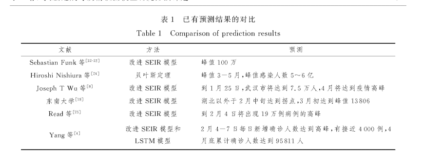

**基于机器学习的新冠肺炎疫情分析**

**------机器学习在新冠疫情下大放光彩**

**提要**

机器学习在新冠疫情下发挥出色，从疫情下网民的情绪、辟谣、分析药物作用、确定肺炎类型、分析和预测新冠数据、疫情防控方面都具有重大作用。

**关键词**

机器学习 新冠肺炎 逻辑回归 情感识别 预测拐点 SEIR模型 Logistic模型

**正文**

**引言**

新型冠状病毒感染的肺炎疫情（下面写为新冠肺炎）肆虐，截止至2021年3月5日，新冠肺炎全球累计确诊116272150病例，累计死亡2582871例，国内现有确诊466例，国内的疫情的防治，离不开方方面面的努力。**本文通过开放资源以及论文的研究和分析，旨在发掘机器学习在整体新冠疫情的防治方面发挥的作用，以及分析机器学习还可能如何在疫情防治中发挥更大的作用。**第一次这么正式的写文章，如有错误，还望海涵。

#### 情感识别和辟谣

新冠肺炎的发生对人们生活生产的方方面面产生了重要影响，并引发国内舆论的广泛关注，众多网民参与疫情相关话题的讨论。不同于传统媒体,线上各种媒体平台上人人可以发声,海量用户生成的内容真假难辨,因此为谣言提供了生存空间。
2020
年1月以来,新型冠状病毒疫情蔓延,网络上谣言也爆发涌现,引发公众恐慌,激发社会矛盾,威胁社会稳定。为应对谣言的潜在风险,制定相关的辟谣策略至关重要。由于互联网的开放性,阻止谣言扩散愈发困难,如果缺乏适当的社会支持,直接封锁谣言信息可能会产生逆火效应，辟谣至关重要。机器学习在这里有两点的作用，一为分析网民情绪，二为对于辟谣提出意见。

**情感识别方面。**（文献【1】）数据集依据与"新冠肺炎"相关的230个主题关键词进行数据采集，抓取了2020年1月1日---2020年2月20日期间共计100万条微博数据，并对其中10万条数据进行人工标注，标注分为三类，分别为：1（积极），0（中性）和-1（消极）。加权融合bert-base和bert-wwm和roberta-wwm三个模型。

分析网民们的情绪，在疫情中可以起到舆论引向的作用。当消极情绪太多，人们容易陷入恐慌，此时便可以帮助做出舆论导向的决策。于是机器学习便发生了作用。

**辟谣方面。**文献【2】 "提出了辟谣效果指数(REI)，搜集 2020 年1月1日至
2020年4月
20日由微博辟谣冶转发的辟谣信息,应用自然语言处理(NLP)方法,以提取辟谣微博的文本特征,分析辟谣微博文本、热门评论的情感倾向。采用人工标注法验证了
REI 对辟谣效果评价的有效性,并探索 REI
与辟谣微博的内容特征与背景特征之间的关系,建立了四种回归模型,基于综合拟合表现最优的
XGBoost 回归模型,利用 SHapley Additive exPlanations(SHAP)对回归结果
进行可视化和分析。 "

疫情刚刚爆发时，我们国家甚至每天都会进行对相关谣言的辟谣。而该文章提出方法的分析结果,可以为不同辟谣情景提出不同的组织辟谣方法的决策建议以增强辟谣效果。尤其是结合上述情感识别方面的研究，恐慌和谣言是最可怕的，会动摇社会的稳定性，此时进行关键的辟谣会发生重要作用！于是，机器学习便可以发挥作用。

#### 分析药物作用

"本文选取了同济医院的1
384名新冠肺炎重症出院患者作为样本,提取使用最多的3类药物作为特征数据集,构建了基于药物用量来预测患者治愈率的机器学习模型,对模型的各个特征重要性进行分析，为临床治疗提供指导参考。"该文章采用了随机森林，Logistic回归，随机梯度下降算法，朴素贝叶斯算法四种方法对药物的疗效采取了10折交叉验证的方法进行了分析。前三种的稳定性和准确性都能满足需要，其中第一种预测准确率最高，被选为了最终的模型。

这篇论文，采用的方式十分基础，无论是逻辑回归、随机梯度下降还是所谓的10折交叉验证，也就是随机训练的方法，这都是十分基础的机器学习的内容和知识，但是却同对于传统的分析药物作用的方法，提供了一种新的思路。

这种方法的优点包括:不需要在控制条件下进行，不需要设置实验组/对照组,所有影响因素都可以同时纳人分析范围，可以直观地查看所有药物药效的影响效果及排名情况,也可以与患者的生理因素进行对比,获取一个相对感性的认知，能不断学习新的数据,改善自身性能。

但是这种方法的缺点是十分明显的，西药见效快，副作用大，中药对于普通的患者效果明显，但是对于重症患者效果并不明显，而选取的是重症患者。而且该实验还具有很多的改进空间，比如分析药物或许可以按照成分进行、再多选择其他的模型等等。

机器学习在这里用的作用不是特别多，甚至有一些为了论文故意使用机器学习的感觉。虽然机器学习在药物分析方面还处于基础阶段，不过可以看出，机器学习仍然能够发挥一定的的作用。

#### 确定肺炎类型

区分普通肺炎、流感和新冠肺炎最好的标准，是进行病原学检测或免疫学检测，也就是进行核酸检测。不过核酸检测结果也存在假阴性，而且也有多次进行核酸检测为阴性的携带者得案例得出现。所以在这篇论文【4】中''采用独立样本t检验的方法对患者检验数据中多个指标进行差异性分析，选择差异性较大的指
标，评估机器学习中线性与非线性算法、集成算法等多种算法在流感与新冠肺炎快速鉴别中的应用效果。结果显示，SVM算
法在新冠肺炎与流感的鉴别问题上效果更好。''。文章中针对逻辑回归算法（LR）、线性判别分析（LDA）、分类与回归树算
法（CART）、支持向量机（SVM）、贝叶斯分类器（NB）和K近邻算法
（KNN）六种算法，采样10折交叉验 证来分离数据，并通过准确度比较算
法，以找到最优算法。并且对不同职称的医生进行了调查。从人工智能辅助决策系统使用和准确性来看，该系统的应用获得了医生们的广大好评，可以看出机器学习{width="3.98125in"
height="3.59375in"}在这次疫情中发挥得作用，也可以看得出来机器学习在未来的医工融合领域潜在的巨大机遇。

#### 预测和分析疫情数据

预测和分析数据是在这次疫情中最为突出的作用，既可以让人们看到希望的存在，又可以安抚人心。我将对此分析，根据论文、csdn文章以及自己的实验进行说明。

**（1）基于Logistic的最简单的数据拟合**

【5】该文章写于2020年2月7日，模型完成于2月6日。文章作者对抓取的china_Dailylist中的数据进行简单的分析，提取出表中的data、与每日确诊人数confirm。画出一个简单的趋势图。利用已有的数据，拟合出Logistic模型，

{width="3.058597987751531in"
height="1.275110454943132in"}

P（t）：人数函数；K：最值；r：增长阻力（如医学隔离导致的疫情增长阻力）。此处作者对r值进行了网格优化和二分优化，最终取为0.29作为了优化结果。接下来进行了对于未来患者的人数预测，与拐点分析。预测拐点的出现日期在2月下旬到3月上旬，患病人数的峰值大约为5万人。

在这里我特意进行了验证。我国疫情的累计确诊人数于2020年2月26日达到顶峰，截止到2020年2月26日24时
全国累计报告确诊病例78497例。虽然具体的人数上面出现了误差，不过拐点预测十分精准。考虑到每时每刻都在变化的疫情防控标准和各种各样的变数，该模型的效果已经十分令人满意了。

**（2）SEIR模型和基于改进SEIR模型的预测**

《新冠病毒疫情预测模型研究方法评述》【6】中对国内外的有一定影响力的模型进行了分析和对比，并将预测结果和实际结果进行对比，结合疫情的发展和各方面因素进行了考量和评定，有助于在重大事故时对于疫情的评估。

{width="5.768055555555556in"
height="2.104861111111111in"}

《一种基于改进SEIR模型的突发公共卫生事件风险 动态评估与预测方法
------以欧洲十国COVID-19为例》【7】"提出了一种基于SEIR模型的突发公共卫生事件风险动态评估与预测方法，将突发公共卫生事件传播与人口、医疗、经济情
况相结合，耦合危险性与脆弱性，建立合理的风险评估综合指标体系，利用熵值---层次分析组合模型实现突发公共卫生事件
风险动态评估。此外，本文建立了传染病传播动力学修正SEIR模型，将传染病传播动力学模拟预测与风险评估相结合，实现
突发公共卫生事件演变趋势的预测和风险的动态预测。"

类似的论文还有很多，都对于疫情确诊人数的拟合、疫情风险的判断做出了不同的方法和研究，这些体现了计算机的计算思维和强大的计算能力，也能够体现处机器学习在分析和预测疫情数据方面的作用。

##### （3）我对全球数据新冠肺炎的拟合

上述的文章体现的是对于我国疫情防控的研究。在上述基础上，参考了相关数据，我对于全球新冠肺炎数据进行了拟合和预测。

在这里我参考上述对中国2020年1月23日-2020年2月5日数据拟合和分析的文章，对于全球新冠肺炎确诊人数进行了拟合。

2021年3月5日，我也采用了最简单的Logistic模型进行初步研究。在这里我手动截取了全球2020年3月至2021年3月的疫情数据。记录下了每月1日的疫情数据。

{width="4.743120078740158in"
height="2.6850656167979in"}

横坐标为疫情出现的第x月1日，纵坐标为全球累计感染人数。具体数据如下：

x=\[3,4,5,6,7,8,9,10,11,12,13,14,15\]\
y=\[6441,798034,3204950,6217534,10575370,17746572,25686206,34252732,46573086,63810182,84087090,103759544,114927071\]

{width="2.587156605424322in"
height="2.253561898512686in"}{width="2.5699015748031497in"
height="2.2385323709536307in"}

之后进行了Logistic模型的拟合。

Logistic函数或Logistic曲线是一种常见的S形函数，它是皮埃尔·弗朗索瓦·韦吕勒在1844或1845年在研究它与人口增长的关系时命名的。广义Logistic曲线可以模仿一些情况人口增长（P）的S形曲线。起初阶段大致是指数增长；然后随着开始变得饱和，增加变慢；最后，达到成熟时增加停止。

{width="3.058597987751531in"
height="1.275110454943132in"}

拟合时得到的最佳的拟合结果为r=0.465094093时。在此基础上，我还进行了细分的检验。

首先分别考虑了r=0.2，0.4，0.6，0.8时的拟合效果，0.4，0.6表现为佳。效果如下图所示。

在r取0.4时。

{width="5.768055555555556in"
height="3.0930555555555554in"}

在r取0.6时

{width="5.768055555555556in"
height="3.0930555555555554in"}

接下来将0.4-0.6的区间分为20万（200000）份，进行拟合分析。最后对比得出，最好的拟合效果为r=0.465094，检验证明r=0.465094093是最好的拟合效果。

下图为r=0.465094093时的拟合效果。

{width="4.990825678040245in"
height="4.347294400699912in"}

{width="5.731391076115486in"
height="3.0733945756780403in"}

2022年2月1日累计确诊人数预计:101085787人\
2022年3月1日累计确诊人数预计:116514328人\
2022年4月1日累计确诊人数预计:128867873人\
2022年5月1日累计确诊人数预计:138061731人\
2022年6月1日累计确诊人数预计:144538351人\
2022年7月1日累计确诊人数预计:148926270人\
2022年8月1日累计确诊人数预计:151821078人\
2022年9月1日累计确诊人数预计:153697487人\
2022年10月1日累计确诊人数预计:154899914人\
2022年11月1日累计确诊人数预计:155664797人\
所以预计在2021年的第三季度可能会出现疫情拐点，预计累计确认人数可达1.5亿人。不过考虑到接下来的奥运会和冬奥会，疫情防控的难度依旧是很大。

此下补充于2021年4月13日。最新的疫情地图如下：

{width="4.90825678040245in"
height="3.2193810148731408in"}

在上述我的拟合中，做出的预测是2022年4月1日累计确诊人数预计:128867873人，如今验证为2022年4月1日累计确诊人数为129823851人，2022年4月13日确诊人数已经达到了137162029人。速度的增幅比我的预测还要高！还要快！这种确诊速度在疫苗已经研究出来的今天是很难想象的。

对此我做出以下解释：

1.  随着春日来临，出行增多，最近国外的疫情再次反复。比如印度、比如意大利等等。

2.  疫苗也出现了问题，外国的疫苗存在问题有不敢打的心理，价格高需要的国家负担不起。而中国的疫苗安全却又有很多国家不买。

{width="5.768055555555556in"
height="2.967361111111111in"}

不过结合其他的疫情防控措施、疫苗的慢慢推广。我相信疫情还是会很快控制下来的，而且会慢慢贴近我上述拟合出的速度。

我原来是打算采用基于改进SEIR模型进行预测的，不过考虑到需要使用matlab，而且SEIR模型的参数特别多，难以设置，所以就没有再进行相关的拟合的操作。

**结论**

本篇文章通过csdn的文章以及知网论文的研究，介绍了疫情期间机器学习的作用。主要有情感识别和辟谣、确定肺炎类型、分析和拟合疫情人数等作用。可以看出来，机器学习的确发挥了不少的作用，而且各种论文也是突飞猛进。不过在我看来，机器学习和其他方面的交融还是太少，机器学习能够发挥的作用还有很多，目前的很多论文、融合是粗浅的、甚至可以说是简单粗暴用来水论文的。试想机器学习是不是可以有更大的作用呢?比如说以后采用无人机配送，可以大大减少接触。比如分析肺炎类型，如果不采用论文上那些简单的分类方法，采用其他的、专门的算法是不是可以真真正正地融入到医学之中呢。可以想象得到，日后的机器学习必将融入各个学科，真正的大放光彩！

**参考文献**

【1】：《疫情期间网民情绪识别比赛分享+top1\~3解决方案》 ------

https://blog.csdn.net/daniellibin/article/details/108424813?utm_source=app&app_version=4.5.2

【2】：《基于辟谣微博的互动及热门评论情感 倾向的辟谣效果研究\*
---------以新冠疫情相关辟谣微博为例》------《情报杂志》2020年11月第39卷第11期

【3】：《基于机器学习的新冠肺炎典型药物疗效分析》------《中国医院药学杂志》2020年6月第40卷第11期

【4】：《基于机器学习的新冠肺炎与流感快速
鉴别方法的研究》------《中国数字医学》

【5】：《关于2019nCoV新冠肺炎的建模（Ⅱ）---基于Logistic模型的疫情预测》

---------https://blog.csdn.net/Zengmeng1998/article/details/104208284

【6】：《新冠病毒疫情预测模型研究方法评述》------《中国计算机用户协会网络应用分会2020年第二十四届网络新技术与应用年会论文集》

【7】：《一种基于改进SEIR模型的突发公共卫生事件风险 动态评估与预测方法
------以欧洲十国COVID-19为例》------《地球信息科学》第32卷第2期2021年2月

**附录**
