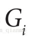
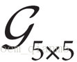
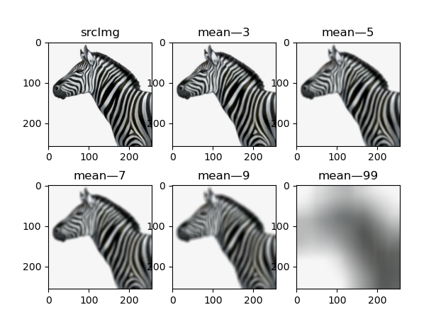
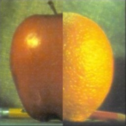
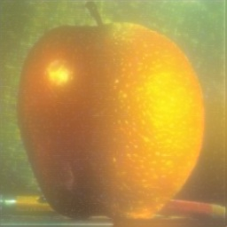
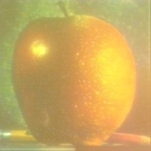

这个实验只放出了与本实验相关的内容，旨在帮助同学们更了解这个问题！

{width="2.9305555555555554in"
height="0.7944444444444444in"}

**计算机视觉 project 1**

**题　　目：[基于拉普拉斯金字塔的图像融合实验]{.ul}**

**专 业：[人工智能 ]{.ul}**

**姓 名：[李桐 ]{.ul}**

**日 期：[2021年10月10日 ]{.ul}**

**\
**

目录 {#目录 .TOC-Heading}
====

[基于拉普拉斯金字塔的图像融合实验 3](#_Toc84791124)

[一、原理 3](#一原理)

[1.1 Blending based on Laplacian pyramid
3](#blending-based-on-laplacian-pyramid)

[1.2 高斯金字塔和拉普拉斯金字塔 3](#高斯金字塔和拉普拉斯金字塔)

[1.2.1 高斯金字塔： 3](#高斯金字塔)

[1.2.2 拉普拉斯金字塔： 4](#拉普拉斯金字塔)

[1.2.3 高斯滤波与均值滤波 5](#高斯滤波与均值滤波)

[二、实验 7](#二实验)

[2.1 滤波实验： 7](#滤波实验)

[2.1.1均值滤波 8](#均值滤波)

[2.1.2高斯滤波 8](#高斯滤波)

[2.1.3中值滤波 9](#中值滤波)

[2.1.4 双边滤波 10](#双边滤波)

[2.2 图像金字塔 11](#图像金字塔)

[2.2.1 高斯金字塔 11](#高斯金字塔-1)

[2.2.2 拉普拉斯金字塔 11](#拉普拉斯金字塔-1)

[2.3 图片融合实验： 13](#图片融合实验)

[三、创新实验 14](#三创新实验这个就不放出来了)

[四、总结 30](#四总结)

[五、参考文献 31](#五参考文献)

**\
**

[]{#_Toc84791124 .anchor}基于拉普拉斯金字塔的图像融合实验

李桐

一、原理
========

1.1 Blending based on Laplacian pyramid 
---------------------------------------

1.给定两幅图像L、R，金字塔层数level

2.建立两幅图像的拉普拉斯金字塔

3.二值掩模mask下采样构建高斯金字塔从而可以拼接左右两幅图像。（如果用python实际上可以不涉及掩模操作）

4.利用mask金字塔每一层的mask图，将L图和R图的拉普拉斯残差金字塔对应层的图像合并为一幅图像。这样得到合并后的拉普拉斯残差金字塔。同时利用最顶端的mask将topL和topR合并为topLR。

5.重建图像:
从最高层结果图。即以topLR为金字塔最顶端的图像，利用pyrUp()函数对topLR进行高斯上采样，得到upTopLR，并将upTopLR与步骤4中合并后的残差金字塔对应层的图像相加，重建出该层的图像。重复本步骤，直至重建出第0层，也就是金字塔最低端的图像。输出。

1.2 高斯金字塔和拉普拉斯金字塔
------------------------------

图像金字塔是图像中多尺度表达的一种，一幅图像的金字塔是一系列以金字塔形状排列的分辨率逐步降低，且来源于同一张原始图的图像集合。其通过梯次向下采样获得，直到达到某个终止条件才停止采样。

金字塔的底部是待处理图像的高分辨率表示，而顶部是低分辨率的近似。这一层一层的图像比喻成金字塔，层级越高，则图像越小，分辨率越低。常见的图像金字塔主要是高斯金字塔和拉普拉斯金字塔。

### 1.2.1 高斯金字塔：

实际操作与理解：

Repeat

{

> 1.对图像进行高斯滤波（平滑化），即对图像G_i进行高斯核卷积；
>
> 2.抛除偶数行和列，依次缩小图片尺寸。

}

根据上述方法每进行一轮循环，得到的图像即为G_i+1的图像，即为一层金字塔，显而易见，结果图像只有原图的四分之一。这个过程称为下采样，即缩小图像。通过对输入图像G_i(原始图像)不停迭代以上步骤就会得到整个金字塔。金字塔底层即原图。同时我们也可以看到，向下取样会逐渐丢失图像的信息。此处又涉及到了高斯滤波和高斯核卷积，这部分内容稍后说明。

### 1.2.2 拉普拉斯金字塔：

拉普拉斯金字塔第i层的数学定义：

{width="3.5083333333333333in"
height="0.5879604111986002in"}

式中的{width="0.275in"
height="0.33in"}表示第i层的图像。而UP（）操作是将源图像中位置为(x,y)的像素映射到目标图像的(2x+1,2y+1)位置，即在进行向上取样。符号{width="0.29492672790901137in"
height="0.275in"}表示卷积，{width="0.30833333333333335in"
height="0.25in"}为5x5的高斯内核。

实际操作与理解：

Repeat

{

> 1.对某一层的图像进行扩充，变为其原大小二倍，中间新增的行列补0。
>
> 2.对图像进行高斯滤波，即使用先前同样的内核(乘以4)与放大后的图像卷积，获得"新增像素"的近似值
>
> 3.用对应层级、对应大小的高斯金字塔图像，与该操作得到的图像作差，插值即属于拉普拉斯金字塔。

}

拉普拉斯金字塔的顶层（即图像尺寸最小的那一层），直接使用高斯金字塔的顶层图像（最小的那一层）。这个过程称为上采样。拉普拉斯金字塔的意义，类似于"残差"图，保留的是与"原图"的差异。拉普拉斯金字塔的L_i层图像，就是高斯金字塔G_i+1层图像上采样后的G'\_i图像与原高斯金字塔中G_i层图像的差值图像。

根据一个拉普拉斯金字塔，就可以自底向上地重构出一个完整的原图。拉普拉斯金字塔的顶层是高斯金字塔顶层，也就是原图的直接缩小化，再根据其他层保存下来的差距，就可以及重构原图。

### 1.2.3 高斯滤波与均值滤波

高斯滤波是从均值滤波发展过来的。图像的噪声来源有很多，比如成像设备的电子器件老化，或者拍摄环境中有外界因素干扰。一种简单的从图像去除噪声的方式就是进行"滤波"。

均值滤波：就是把将滤波图像像素点的灰度值，改成周围8个方位以及它本身的灰度值之和的平均值，以此来达到消除噪声，平滑图像的的作用。

{width="1.45in" height="1.0520931758530183in"}

比如上面的卷积核，假设这个卷积核与一个3x3的区域相乘，实际上就是实现了求和再均值功能。假设一个图片中的足球正好需要3x3=9个像素进行表示，那么通过与kernel卷积就导致这9个像素都趋于平滑，也就是说某个像素点将会被周围8个像素点"平均"。

高斯滤波：均值滤波很相似，唯一的不同就是他修改根据高斯模型，修改了每个像素点的权重，离中心点越近的，其权值占比也就越重。

{width="1.6166666666666667in"
height="1.1138451443569555in"}

服从高斯分布的卷积核，就是中间高两边低。这个卷积核最后要除以16（卷积核所有的数值相加等于16）。

理论上均值滤波的结果

{width="5.768055555555556in"
height="2.9631944444444445in"}

理论上高斯滤波的结果

{width="5.768055555555556in"
height="2.948611111111111in"}

二、实验
========

2.1 滤波实验：
--------------

{width="5.768055555555556in"
height="4.8069444444444445in"}

这里尝试了均值滤波、高斯滤波、中值滤波以及双边缘滤波。实验图像如下。

{width="4.158333333333333in"
height="2.3134667541557303in"}

总体上看均值滤波更加模糊，高斯滤波较均值滤波更好。但是仍然会降低一些清晰度。中值滤波在间隙大的边缘上的效果较好，在密集处的效果不佳。双边滤波最清晰，和原图类似。

### 2.1.1均值滤波

在均值滤波中实验中，分别用3\*3，5\*5，7\*7，9\*9，99\*99的卷积核进行平均，图象如下。

实验中出现了，核越大，结果越模糊的实验现象。这是因为越大的核会平均越大的范围，所以范围越大，越模糊。

{width="4.533333333333333in"
height="3.3465594925634297in"}

### 2.1.2高斯滤波

在均值滤波中实验中，分别用3\*3，5\*5，7\*7，9\*9，99\*99的高斯核进行高斯滤波，图象如下。

实验中总体的规律还是，核越大，图象越模糊。但是总体上每个等级上的高斯滤波要好于均值滤波。这是因为越大的核会导致这个像素点受到越大的范围的影响，所以范围越大，越模糊，但是高斯滤波中受到远距离的影响要低于均值滤波，所以要好于均值滤波。

{width="3.875in" height="2.94633530183727in"}

### 2.1.3中值滤波

中值滤波是一种非线性平滑技术，它将每一像素点的灰度值设置为该点某邻域窗口内的所有像素点灰度值的中值。在中值滤波中实验中，分别用3\*3，5\*5，7\*7，9\*9，99\*99的范围进行中值滤波，图象如下。

实验中总体的规律是，核越大，图象越模糊。中值滤波的性能一般。按理说值滤波会导致图像的边缘不清晰，因为中值的选择很可能基于图像的背景像素进行，但是给我的观看感受是中值滤波的边缘始终是十分清晰的，均值滤波以及高斯滤波的边缘都会逐渐模糊，但是中值滤波的边缘要更清晰。这是在实验中出现的一个小疑问。

{width="4.158333333333333in"
height="3.1169553805774277in"}

### 2.1.4 双边滤波

双边滤波中，输出像素基于相邻像素的计算的权重值进行，而权重函数的系数基于一个Domain
Kernel和Range Kernel计算而来。Domain Kernel通常是高斯Kernel，而Range
Kernel用于计算相邻像素与中心像素的相似度。其重要的特点是能够保持图像的边缘清晰（高斯滤波会导致像素移位），这在检测应用中有重要的意义。

{width="3.2666666666666666in"
height="2.575640857392826in"}

上图为核半径分别为3，5，7，9，99的滤波图像。效果很好，但是速度奇慢。其他的几乎运行即得结果，双边滤波需要很久。另外在试验中发现，核半径越大，处理的时间越久。最后还发现，空间高斯函数标准差，灰度值相似性高斯函数标准差对于本次实验的影响很小。本次实验验证了0，75，150，200，四个档次的空间高斯函数标准差，灰度值相似性高斯函数标准差，实验结果几乎没有差别。下图为核直径、空间高斯函数标准差、灰度值相似性高斯函数标准差分别为，198,0,0，198,200,0的两幅图像。（差别最大在于鼻子处）

198,0,0 198,200,0

{width="1.9583333333333333in"
height="2.1894411636045494in"}{width="1.95in"
height="2.1801246719160106in"}

2.2 图像金字塔
--------------

### 2.2.1 高斯金字塔

高斯金字塔只需要每次先进行高斯核卷积再进行采样就好，在python里面的操作就是调用cv.pyrDown（）函数，每次调用时传入上一次的图片，不断进行下采样。

如图所示，构造了高斯金字塔：

{width="2.6666666666666665in"
height="2.6666666666666665in"}{width="1.3333333333333333in"
height="1.3333333333333333in"}{width="0.6666666666666666in"
height="0.6666666666666666in"}{width="0.3333333333333333in"
height="0.3333333333333333in"}

### 2.2.2 拉普拉斯金字塔

高斯金字塔中任意一张图Gi（比如G0为最初的高分辨率图像）先进行下采样得到图Down(Gi)，再进行上采样得到图Up(Down(Gi))，得到Up(Down(Gi))与Gi是存在差异的，因为下采样过程丢失的信息不能通过上采样来完全恢复，也就是说下采样是不可逆的。原始图片下采样后得到的小尺寸图片虽然保留了视觉效果，但是将该小尺寸图像再次上采样也不能完整的恢复出原始图像。为了能够从下采样图像Down(Gi)中还原原始图像Gi，记录再次上采样得到Up(Down(Gi))与原始图片Gi之间的差异，也就是拉普拉斯金字塔。

原始图片 Gi 下采样后Down(Gi)

{width="2.6666666666666665in"
height="2.6666666666666665in"}{width="1.3333333333333333in"
height="1.3333333333333333in"}

上采样后 Up(Down(Gi)) Gi- Up(Down(Gi))

{width="2.45in"
height="2.45in"}{width="2.4833333333333334in"
height="2.4833333333333334in"}

先获得高斯金字塔，对于当前的Gi先做下采样再做上采样，做差，即得拉普拉斯金字塔，如下：

{width="2.6666666666666665in"
height="2.6666666666666665in"}{width="1.3333333333333333in"
height="1.3333333333333333in"}{width="0.6666666666666666in"
height="0.6666666666666666in"}{width="0.3333333333333333in"
height="0.3333333333333333in"}

2.3 图片融合实验：
------------------

首先把两张图片的拉普拉斯金字塔中对应层数的对应图片分别相加，即苹果留下左边，橘子留下右边，然后把图片合在一起。上文中说了利用拉普拉斯金字塔可以大致复原一个图片。因为拉普拉斯金字塔Li=原始图片Gi−Up(Down

(Gi+1)) 。所以我们可以得到，Gi= Li+ Up(Down(Gi+1))。

第一次运算时拉普拉斯金字塔顶层（最小的）保存的就可以看作Gi+1，第二层（第二小的）就是Li，所以可以回复出Gi。恢复出的Gi看作Gi+1再利用下一层继续回复。循此以往即可得到最后的图片。

直接拼接 1层拉普拉斯金字塔 2层

{width="1.8083333333333333in"
height="1.8083333333333333in"}{width="1.8166666666666667in"
height="1.8166666666666667in"}{width="1.825in"
height="1.825in"}

3层 4层 5层

{width="1.8166666666666667in"
height="1.8166666666666667in"}{width="1.825in"
height="1.825in"}{width="1.8166666666666667in"
height="1.8166666666666667in"}

6层 7层 8层

{width="1.8333333333333333in"
height="1.8333333333333333in"}{width="1.8583333333333334in"
height="1.8583333333333334in"}{width="1.8666666666666667in"
height="1.8666666666666667in"}

在这里采用的是256\*256的两张图片进行合成。原图像的苹果和橘子图片是截下来的图片，然后调整为了256\*256。根据上述图片，以清晰的看到，图片主体苹果和橘子随着拉普拉斯金字塔的层数增加，其融合效果越好，但是随着层数的增加，颜色也越来越失真。主体颜色会慢慢影响背景、背景的颜色慢慢影响主体，所以图片看上去越来越模糊。

在苹果和橘子图片的合成的代码实现时，首先是pyrUp和pyrDown对图像先放大后缩小或者是先缩小后放大后，可能rows和cols和原图像不同，需要resize才能恢复。

三、创新实验
============

四、总结
========

其实这个实验大概用了几个整天的时间吧，从中秋之前就开始做了，然后放假回来老师也讲了一些，到了28号才基本做完了自己的全部想法。从理论到实践，从基本的金字塔、融合实验到我的新想法、到图片的细节增强、色彩增强我能想到的这些额外的优化方法，总体来说还算满意。

最终图象：

{width="1.9916666666666667in"
height="1.9916666666666667in"}{width="2.0166666666666666in"
height="2.0166666666666666in"}

五、参考文献
============

\[1\]:胡钢, 刘哲,
徐小平等.像素级图像融合技术的研究与进展\[D\].计算机应用研究,
第2５卷第３期2008.3

\[2\]: Youngbae Kim, Yeong Jun Koh等.DARK IMAGE ENHANCEMENT BASED ON
PAIRWISE TARGET CONTRAST AND MULTI-SCALE DETAIL BOOSTING, IEEE
International Conference on Image Processing, ICIP 2015, 1404-1408
