{width="2.9305555555555554in"
height="0.7944444444444444in"}

**计算机视觉 project 1**

**题　　目：[基于拉普拉斯金字塔的图像融合实验]{.ul}**

**专 业：[人工智能 ]{.ul}**

**姓 名：[李桐 ]{.ul}**

**日 期：[2021年10月10日 ]{.ul}**

**\

**

目录 {#目录 .TOC-Heading}
====

[基于拉普拉斯金字塔的图像融合实验 3](#_Toc84791124)

[一、原理 3](#一原理)

[1.1 Blending based on Laplacian pyramid
3](#blending-based-on-laplacian-pyramid)

[1.2 高斯金字塔和拉普拉斯金字塔 3](#高斯金字塔和拉普拉斯金字塔)

[1.2.1 高斯金字塔： 3](#高斯金字塔)

[1.2.2 拉普拉斯金字塔： 4](#拉普拉斯金字塔)

[1.2.3 高斯滤波与均值滤波 5](#高斯滤波与均值滤波)

[二、实验 7](#二实验)

[2.1 滤波实验： 7](#滤波实验)

[2.1.1均值滤波 8](#均值滤波)

[2.1.2高斯滤波 8](#高斯滤波)

[2.1.3中值滤波 9](#中值滤波)

[2.1.4 双边滤波 10](#双边滤波)

[2.2 图像金字塔 11](#图像金字塔)

[2.2.1 高斯金字塔 11](#高斯金字塔-1)

[2.2.2 拉普拉斯金字塔 11](#拉普拉斯金字塔-1)

[2.3 图片融合实验： 13](#图片融合实验)

[三、创新实验 14](#三创新实验)

[3.1常见的图像融合方法 14](#常见的图像融合方法)

[3.2 基于多尺度滤波的边界模糊方法 17](#基于多尺度滤波的边界模糊方法)

[3.2.1 过程1 17](#过程1)

[3.2.2 过程2 18](#过程2)

[3.2.3 过程3 19](#过程3)

[3.2.4 过程4 21](#过程4)

[3.2.5 过程5 21](#过程5)

[3.2.6 方法总结 22](#方法总结)

[3.3 基于SSE的细节恢复实验 23](#基于sse的细节恢复实验)

[3.3.1 Retinex图像增强算法SSR 23](#retinex图像增强算法ssr)

[3.3.2 SSE实验 25](#sse实验)

[3.4 色彩恢复实验 27](#色彩恢复实验)

[3.4.1 色彩恢复相关算法 27](#色彩恢复相关算法)

[3.4.2 gamma矫正实验 29](#gamma矫正实验)

[四、总结 30](#四总结)

[五、参考文献 31](#五参考文献)

**\

**

[]{#_Toc84791124 .anchor}基于拉普拉斯金字塔的图像融合实验

李桐

一、原理
========

1.1 Blending based on Laplacian pyramid 
---------------------------------------

1.给定两幅图像L、R，金字塔层数level

2.建立两幅图像的拉普拉斯金字塔

3.二值掩模mask下采样构建高斯金字塔从而可以拼接左右两幅图像。（如果用python实际上可以不涉及掩模操作）

4.利用mask金字塔每一层的mask图，将L图和R图的拉普拉斯残差金字塔对应层的图像合并为一幅图像。这样得到合并后的拉普拉斯残差金字塔。同时利用最顶端的mask将topL和topR合并为topLR。

5.重建图像:
从最高层结果图。即以topLR为金字塔最顶端的图像，利用pyrUp()函数对topLR进行高斯上采样，得到upTopLR，并将upTopLR与步骤4中合并后的残差金字塔对应层的图像相加，重建出该层的图像。重复本步骤，直至重建出第0层，也就是金字塔最低端的图像。输出。

1.2 高斯金字塔和拉普拉斯金字塔
------------------------------

图像金字塔是图像中多尺度表达的一种，一幅图像的金字塔是一系列以金字塔形状排列的分辨率逐步降低，且来源于同一张原始图的图像集合。其通过梯次向下采样获得，直到达到某个终止条件才停止采样。

金字塔的底部是待处理图像的高分辨率表示，而顶部是低分辨率的近似。这一层一层的图像比喻成金字塔，层级越高，则图像越小，分辨率越低。常见的图像金字塔主要是高斯金字塔和拉普拉斯金字塔。

### 1.2.1 高斯金字塔：

实际操作与理解：

Repeat

{

> 1.对图像进行高斯滤波（平滑化），即对图像G_i进行高斯核卷积；
>
> 2.抛除偶数行和列，依次缩小图片尺寸。

}

根据上述方法每进行一轮循环，得到的图像即为G_i+1的图像，即为一层金字塔，显而易见，结果图像只有原图的四分之一。这个过程称为下采样，即缩小图像。通过对输入图像G_i(原始图像)不停迭代以上步骤就会得到整个金字塔。金字塔底层即原图。同时我们也可以看到，向下取样会逐渐丢失图像的信息。此处又涉及到了高斯滤波和高斯核卷积，这部分内容稍后说明。

### 1.2.2 拉普拉斯金字塔：

拉普拉斯金字塔第i层的数学定义：

{width="3.5083333333333333in"
height="0.5879604111986002in"}

式中的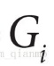{width="0.275in"
height="0.33in"}表示第i层的图像。而UP（）操作是将源图像中位置为(x,y)的像素映射到目标图像的(2x+1,2y+1)位置，即在进行向上取样。符号{width="0.29492672790901137in"
height="0.275in"}表示卷积，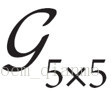{width="0.30833333333333335in"
height="0.25in"}为5x5的高斯内核。

实际操作与理解：

Repeat

{

> 1.对某一层的图像进行扩充，变为其原大小二倍，中间新增的行列补0。
>
> 2.对图像进行高斯滤波，即使用先前同样的内核(乘以4)与放大后的图像卷积，获得"新增像素"的近似值
>
> 3.用对应层级、对应大小的高斯金字塔图像，与该操作得到的图像作差，插值即属于拉普拉斯金字塔。

}

拉普拉斯金字塔的顶层（即图像尺寸最小的那一层），直接使用高斯金字塔的顶层图像（最小的那一层）。这个过程称为上采样。拉普拉斯金字塔的意义，类似于"残差"图，保留的是与"原图"的差异。拉普拉斯金字塔的L_i层图像，就是高斯金字塔G_i+1层图像上采样后的G'\_i图像与原高斯金字塔中G_i层图像的差值图像。

根据一个拉普拉斯金字塔，就可以自底向上地重构出一个完整的原图。拉普拉斯金字塔的顶层是高斯金字塔顶层，也就是原图的直接缩小化，再根据其他层保存下来的差距，就可以及重构原图。

### 1.2.3 高斯滤波与均值滤波

高斯滤波是从均值滤波发展过来的。图像的噪声来源有很多，比如成像设备的电子器件老化，或者拍摄环境中有外界因素干扰。一种简单的从图像去除噪声的方式就是进行"滤波"。

均值滤波：就是把将滤波图像像素点的灰度值，改成周围8个方位以及它本身的灰度值之和的平均值，以此来达到消除噪声，平滑图像的的作用。

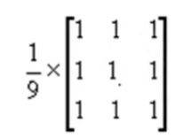{width="1.45in" height="1.0520931758530183in"}

比如上面的卷积核，假设这个卷积核与一个3x3的区域相乘，实际上就是实现了求和再均值功能。假设一个图片中的足球正好需要3x3=9个像素进行表示，那么通过与kernel卷积就导致这9个像素都趋于平滑，也就是说某个像素点将会被周围8个像素点"平均"。

高斯滤波：均值滤波很相似，唯一的不同就是他修改根据高斯模型，修改了每个像素点的权重，离中心点越近的，其权值占比也就越重。

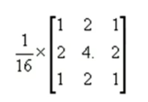{width="1.6166666666666667in"
height="1.1138451443569555in"}

服从高斯分布的卷积核，就是中间高两边低。这个卷积核最后要除以16（卷积核所有的数值相加等于16）。

理论上均值滤波的结果

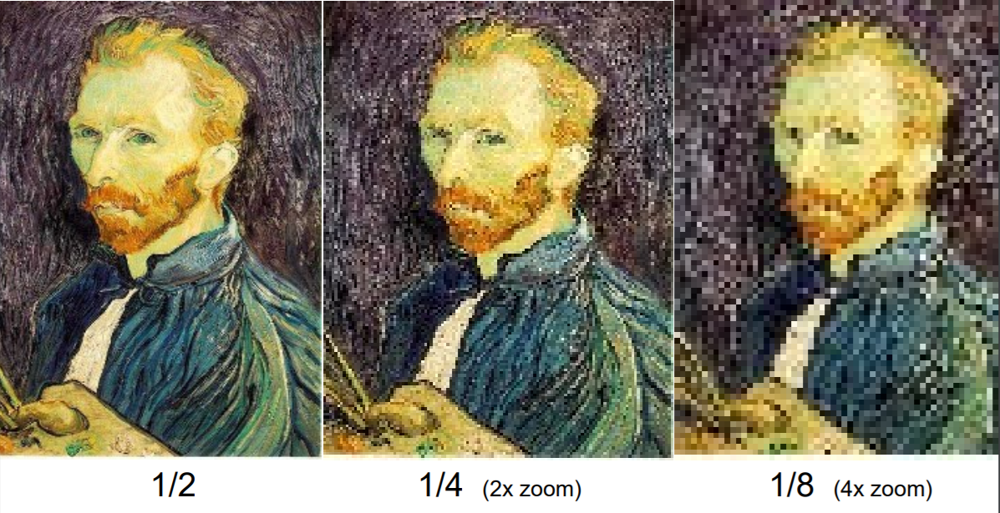{width="5.768055555555556in"
height="2.9631944444444445in"}

理论上高斯滤波的结果

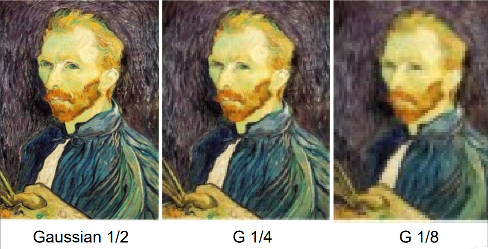{width="5.768055555555556in"
height="2.948611111111111in"}

二、实验
========

2.1 滤波实验：
--------------

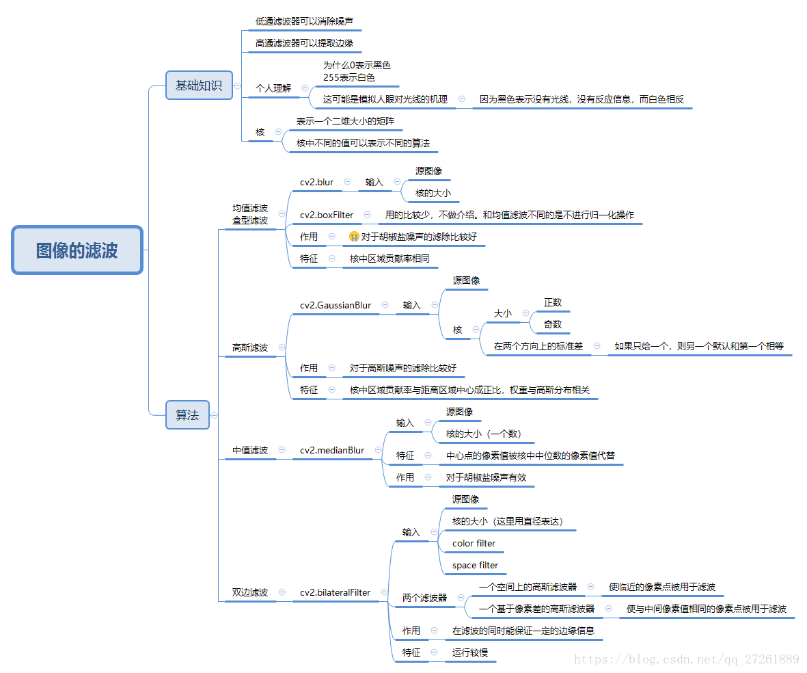{width="5.768055555555556in"
height="4.8069444444444445in"}

这里尝试了均值滤波、高斯滤波、中值滤波以及双边缘滤波。实验图像如下。

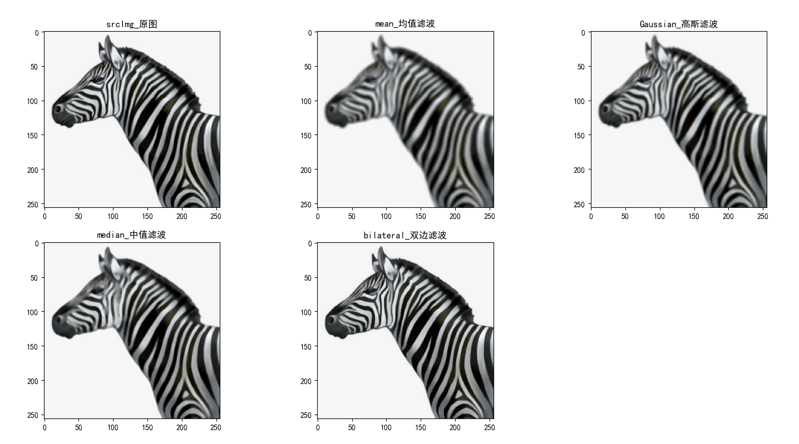{width="4.158333333333333in"
height="2.3134667541557303in"}

总体上看均值滤波更加模糊，高斯滤波较均值滤波更好。但是仍然会降低一些清晰度。中值滤波在间隙大的边缘上的效果较好，在密集处的效果不佳。双边滤波最清晰，和原图类似。

### 2.1.1均值滤波

在均值滤波中实验中，分别用3\*3，5\*5，7\*7，9\*9，99\*99的卷积核进行平均，图象如下。

实验中出现了，核越大，结果越模糊的实验现象。这是因为越大的核会平均越大的范围，所以范围越大，越模糊。

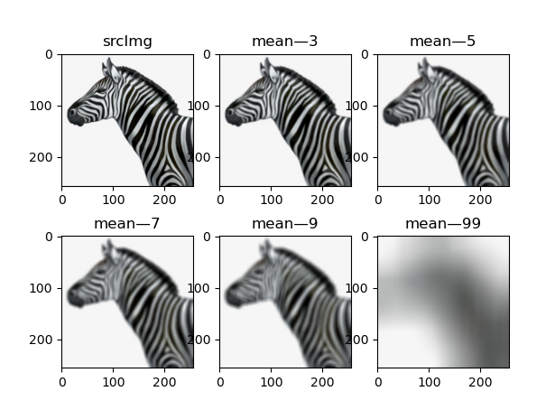{width="4.533333333333333in"
height="3.3465594925634297in"}

### 2.1.2高斯滤波

在均值滤波中实验中，分别用3\*3，5\*5，7\*7，9\*9，99\*99的高斯核进行高斯滤波，图象如下。

实验中总体的规律还是，核越大，图象越模糊。但是总体上每个等级上的高斯滤波要好于均值滤波。这是因为越大的核会导致这个像素点受到越大的范围的影响，所以范围越大，越模糊，但是高斯滤波中受到远距离的影响要低于均值滤波，所以要好于均值滤波。

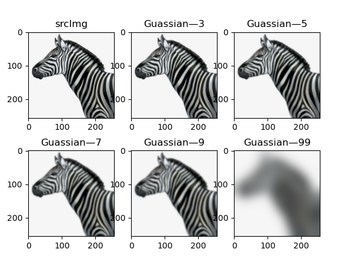{width="3.875in" height="2.94633530183727in"}

### 2.1.3中值滤波

中值滤波是一种非线性平滑技术，它将每一像素点的灰度值设置为该点某邻域窗口内的所有像素点灰度值的中值。在中值滤波中实验中，分别用3\*3，5\*5，7\*7，9\*9，99\*99的范围进行中值滤波，图象如下。

实验中总体的规律是，核越大，图象越模糊。中值滤波的性能一般。按理说值滤波会导致图像的边缘不清晰，因为中值的选择很可能基于图像的背景像素进行，但是给我的观看感受是中值滤波的边缘始终是十分清晰的，均值滤波以及高斯滤波的边缘都会逐渐模糊，但是中值滤波的边缘要更清晰。这是在实验中出现的一个小疑问。

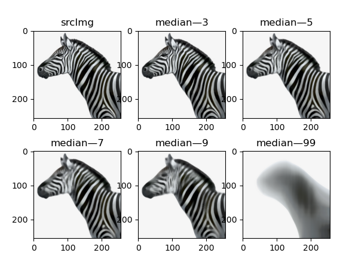{width="4.158333333333333in"
height="3.1169553805774277in"}

### 2.1.4 双边滤波

双边滤波中，输出像素基于相邻像素的计算的权重值进行，而权重函数的系数基于一个Domain
Kernel和Range Kernel计算而来。Domain Kernel通常是高斯Kernel，而Range
Kernel用于计算相邻像素与中心像素的相似度。其重要的特点是能够保持图像的边缘清晰（高斯滤波会导致像素移位），这在检测应用中有重要的意义。

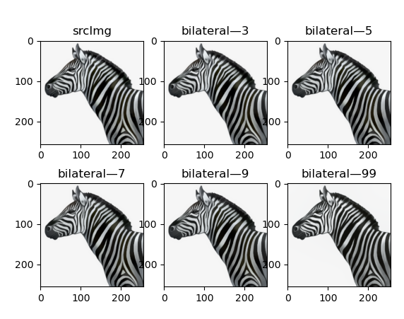{width="3.2666666666666666in"
height="2.575640857392826in"}

上图为核半径分别为3，5，7，9，99的滤波图像。效果很好，但是速度奇慢。其他的几乎运行即得结果，双边滤波需要很久。另外在试验中发现，核半径越大，处理的时间越久。最后还发现，空间高斯函数标准差，灰度值相似性高斯函数标准差对于本次实验的影响很小。本次实验验证了0，75，150，200，四个档次的空间高斯函数标准差，灰度值相似性高斯函数标准差，实验结果几乎没有差别。下图为核直径、空间高斯函数标准差、灰度值相似性高斯函数标准差分别为，198,0,0，198,200,0的两幅图像。（差别最大在于鼻子处）

198,0,0 198,200,0

{width="1.9583333333333333in"
height="2.1894411636045494in"}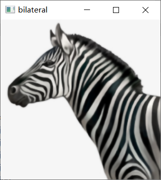{width="1.95in"
height="2.1801246719160106in"}

2.2 图像金字塔
--------------

### 2.2.1 高斯金字塔

高斯金字塔只需要每次先进行高斯核卷积再进行采样就好，在python里面的操作就是调用cv.pyrDown（）函数，每次调用时传入上一次的图片，不断进行下采样。

如图所示，构造了高斯金字塔：

{width="2.6666666666666665in"
height="2.6666666666666665in"}{width="1.3333333333333333in"
height="1.3333333333333333in"}{width="0.6666666666666666in"
height="0.6666666666666666in"}{width="0.3333333333333333in"
height="0.3333333333333333in"}

### 2.2.2 拉普拉斯金字塔

高斯金字塔中任意一张图Gi（比如G0为最初的高分辨率图像）先进行下采样得到图Down(Gi)，再进行上采样得到图Up(Down(Gi))，得到Up(Down(Gi))与Gi是存在差异的，因为下采样过程丢失的信息不能通过上采样来完全恢复，也就是说下采样是不可逆的。原始图片下采样后得到的小尺寸图片虽然保留了视觉效果，但是将该小尺寸图像再次上采样也不能完整的恢复出原始图像。为了能够从下采样图像Down(Gi)中还原原始图像Gi，记录再次上采样得到Up(Down(Gi))与原始图片Gi之间的差异，也就是拉普拉斯金字塔。

原始图片 Gi 下采样后Down(Gi)

{width="2.6666666666666665in"
height="2.6666666666666665in"}{width="1.3333333333333333in"
height="1.3333333333333333in"}

上采样后 Up(Down(Gi)) Gi- Up(Down(Gi))

{width="2.45in"
height="2.45in"}{width="2.4833333333333334in"
height="2.4833333333333334in"}

先获得高斯金字塔，对于当前的Gi先做下采样再做上采样，做差，即得拉普拉斯金字塔，如下：

{width="2.6666666666666665in"
height="2.6666666666666665in"}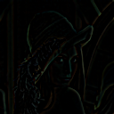{width="1.3333333333333333in"
height="1.3333333333333333in"}{width="0.6666666666666666in"
height="0.6666666666666666in"}{width="0.3333333333333333in"
height="0.3333333333333333in"}

2.3 图片融合实验：
------------------

首先把两张图片的拉普拉斯金字塔中对应层数的对应图片分别相加，即苹果留下左边，橘子留下右边，然后把图片合在一起。上文中说了利用拉普拉斯金字塔可以大致复原一个图片。因为拉普拉斯金字塔Li​=原始图片Gi​−Up(Down

(Gi+1)​) 。所以我们可以得到，Gi= Li​+ Up(Down(Gi+1)​)。

第一次运算时拉普拉斯金字塔顶层（最小的）保存的就可以看作Gi+1，第二层（第二小的）就是Li，所以可以回复出Gi。恢复出的Gi看作Gi+1再利用下一层继续回复。循此以往即可得到最后的图片。

直接拼接 1层拉普拉斯金字塔 2层

{width="1.8083333333333333in"
height="1.8083333333333333in"}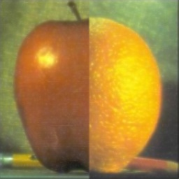{width="1.8166666666666667in"
height="1.8166666666666667in"}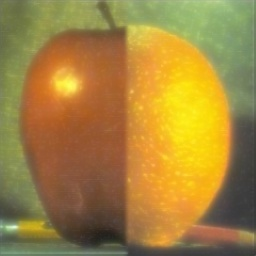{width="1.825in"
height="1.825in"}

3层 4层 5层

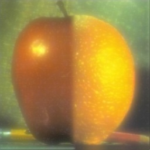{width="1.8166666666666667in"
height="1.8166666666666667in"}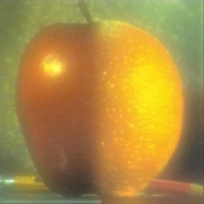{width="1.825in"
height="1.825in"}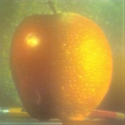{width="1.8166666666666667in"
height="1.8166666666666667in"}

6层 7层 8层

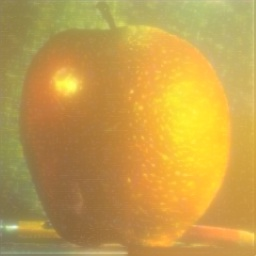{width="1.8333333333333333in"
height="1.8333333333333333in"}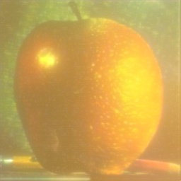{width="1.8583333333333334in"
height="1.8583333333333334in"}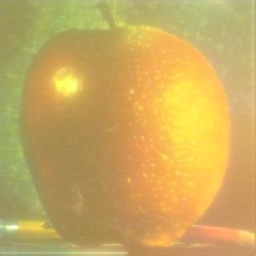{width="1.8666666666666667in"
height="1.8666666666666667in"}

在这里采用的是256\*256的两张图片进行合成。原图像的苹果和橘子图片是截下来的图片，然后调整为了256\*256。根据上述图片，以清晰的看到，图片主体苹果和橘子随着拉普拉斯金字塔的层数增加，其融合效果越好，但是随着层数的增加，颜色也越来越失真。主体颜色会慢慢影响背景、背景的颜色慢慢影响主体，所以图片看上去越来越模糊。

在苹果和橘子图片的合成的代码实现时，首先是pyrUp和pyrDown对图像先放大后缩小或者是先缩小后放大后，可能rows和cols和原图像不同，需要resize才能恢复。

三、创新实验
============

3.1常见的图像融合方法
---------------------

1.最简单的图片融合就是直接一半一半，左边留下一半，右边留下一半，两幅有重合区域的图片，如果直接根据这个位置来拼接，那么由于两幅图片自身的差异，拼接完的图片上会有很明显的拼接线存在。

2.解决方法1的这个问题，最简单的方法是对两幅图片的重合区域的像素进行加权相加(这个操作可以理解为一种羽化的处理效果)。设定一个权重w，就有公式：PB(i,j)
= (1-w)\*PA(i,j) + w\*PB(i,j)可以计算重合区域融合后的像素值。

但是，这种简单的羽化对两幅图片的质量要求非常高，很对情况下并不能得到一个理想的效果。

如图所示，下图是随羽化范围减小，图片的分界线越清晰。

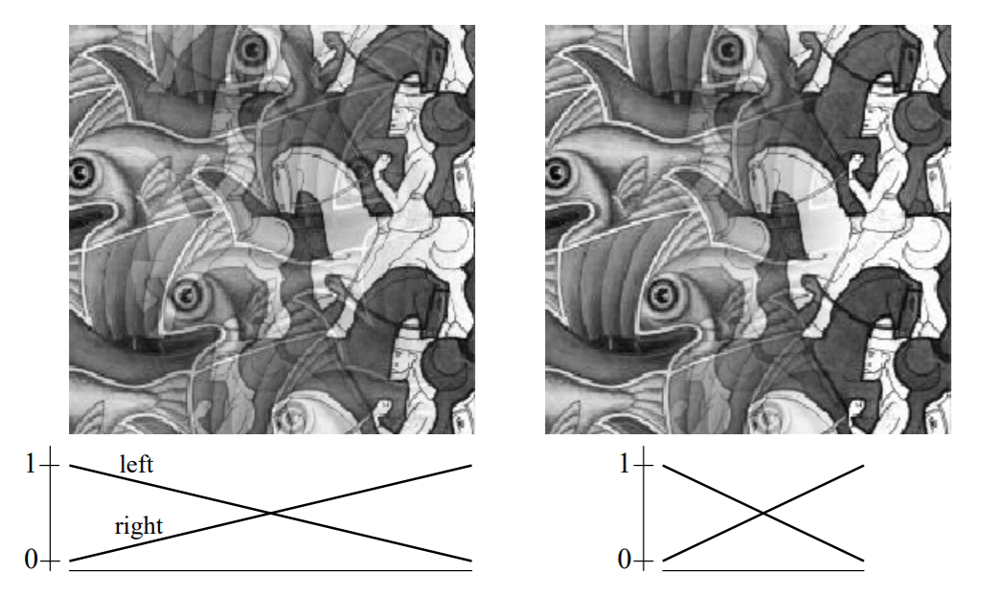{width="2.8916666666666666in"
height="1.7198206474190727in"}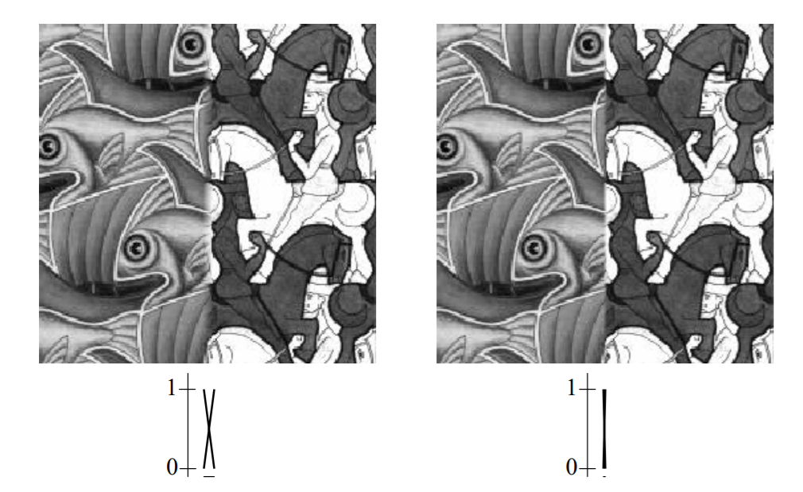{width="2.8093536745406826in"
height="1.7243055555555555in"}

3.下一种就是更为复杂的图像金字塔融合算法。也就是上文所利用的方法。

在我的学习中还学到了这样一种分类方式，像素级图像融合主要包括：基于非多尺度变换的图像融合方法和基于多尺度变换的图像融合方法。

基于非多尺度变换的图像融合方法：

1.平均与加权平均方法，加权平均方法将原图像对应像素的灰度值进行加权平均,生成新的图像，它是最直接的融合方法。其中平均方法是加权平均的特例。使用平均方法进行图像融合，提高了融合图像的信噪比,但削弱了图像的对比度,尤其对于只出现在其中一幅图像上的有用信号。

2.像素灰度值选大（或小）的图像融合方法，假设参加融合的两幅原图像分别为A、B，图像大小分别为M\*N,融合图像为F，则针对原图像A、B的像素灰度值选大（或小）图像融合方法可表示为

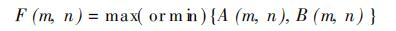{width="4.125in" height="0.325in"}

还有基于PCA的图像融合方法、基于调制的图像融合方法、非线性方法等等。

基于多尺度变换的图像融合方法：基于多尺度变换的融合方法的主要步骤为:对原图像分别进行多尺度分解,得到变换域的一系列子图像;采用一定的融合规则，提取变换域中每个尺度上最有效的特征，得到复合的多尺度表示;对复合的多尺度表示进行多尺度逆变换,得到融合后的图像。主要方法有：

（1）.基于金字塔变换的图像融合方法

（2）.基于小波变换的图像融合方法，基于小波变换的图像融合方法的基本步骤为:对每一幅原图像分别进行小波变换，建立图像的小波金字塔分解;对各分解层从高到低分别进行融合处理，各分解层上的不同频率分量可采用不同的融合规则进行融合处理,最终得到融合后的小波金字塔;对融合后所得的小波金字塔进行小波逆变换,所得重构图像即为融合图像。下图给出了基于小波变换的图像融合方法的结构示意图。

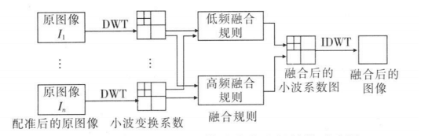{width="4.608333333333333in"
height="1.4856714785651794in"}

基于小波变换的图像融合方法的研究主要集中在以下几个方面：融合规则及融合算子的选择、小波分解与重构的形式、小波融合方法与其他融合方法的结合。\[1\]

3.基于Ridgelet变换的图像融合方法，当小波变换推广到二维或更高维时,由一维小波张成的可分离小波只有有限的方向,不能最优表示含线或者面奇异的高维函数。因此,小波只能反映信号的点奇异性(零维),而对诸如二维图像中的边缘以及线状特征等线、面奇异性(一维或更高维),小波则难以表达其特征。针对小波变换的不足,Candes提出了一种适合分析一维或更高维奇异性的脊波(
Ridgelet)变换。

4\. 基于Curvelet变换的图像融合方法，Curvelet变换是由Candes提
出的Ridgelet变换演变而来的。Ridgelet变换对含有直线奇异的多变量函数有很好的逼近效果，能稀疏地表示包含直线边缘的分片平滑图像。但是对于含有曲线奇异的图像,
Ridgelet变换的逼近性能只与小波变换相当。由于多尺度Ridgelet分析冗余度很大，Candes和Donoho于1999年提出了曲线波(
Curveleb)变换理论,即第一代Cuvelet变换。其基本思想是:首先对图像进行子带分解;然后对不同尺度的子带图像采用不同大小的分块;最后对每个块进行Ridgelet分析。

另外还有还有NSCT、NSST、稀疏表示、CNN等方法。

总之我认为大多数的多尺度变换的图像融合方法归根结底就是通过不同的方法获得两幅图之间的不同维度的特点或者细节之后再进行融合。如，基于导向滤波的图像融合(GFF)，对每个原图进行平滑滤波，可以得到一张平滑图，再用原图减去平滑图，可以得到一张细节图，在平滑图和细节图的双尺度下进行融合算法的创新。利用Saliency（显著性）来构建融合权重，并利用Guided
Filter（导向滤波）优化权重，对多源图像加权融合，思想简单但是好用，效果也不错。适用于多焦距、多光谱、高动态等融合场景。如，基于双边滤波（BF）和加权最小二乘滤波（WLS）的RGB-NIR图像融合细节增强方法，利用双边滤波器和加权最小二乘滤波器对RGB图像和NIR图像进行融合，核心思想即提取NIR图像中的细节层，与之将RGB的基础层，即相对平滑的部分相加，得到融合后的图片。

3.2 基于多尺度滤波的边界模糊方法
--------------------------------

做完了基础的实验之后，我就在考虑能不能够用更简单的方式进行实验呢？其实最终的目的就是将图片中的一条线进行模糊，那么为什么不直接进行模糊化处理呢？抱着这样的心态我开始了尝试，并且起了一个高大上的名字。

### 3.2.1 过程1

参考滤波实验，因为滤波范围太大了，会使整个图片都模糊，而且模糊的程度相同，中间还是一个线。那么可不可以提取图片最中间的区域进行滤波，然后再拼接到一起。不断地放大这个滤波范围，这样不就实现了最中间最模糊化了也就是模糊了那条分界线了吗？

于是我就开始了实验，关键代码如下：

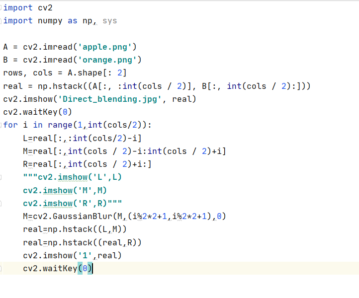{width="3.6083333333333334in"
height="2.9984000437445317in"}

下面左图是实验中的一张截图，可以看到中间仍是明显的分界线。这是进行到了如右图所示的滤波范围时的截图，继续进行滤波效果依旧很差。

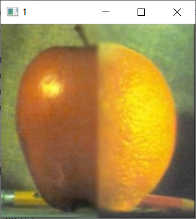{width="2.5416666666666665in"
height="2.8451476377952756in"}{width="2.55in"
height="2.854478346456693in"}

### 3.2.2 过程2

那么会不会是因为高斯滤波的原因呢？假如采用均值滤波，中间是不是就会被平均的更严重一些，以至于模糊中线呢？

原图 处理后

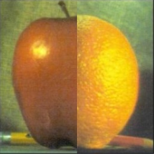{width="2.375in"
height="2.375in"}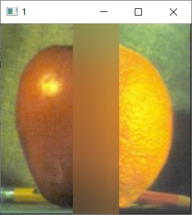{width="2.183333333333333in"
height="2.440994094488189in"}

均值滤波的模糊效果确实好了，但是却过于模糊，以至于模糊掉了边界。那下一步要怎么办呢？

上图的结果是在像素不断增加，每次都做这个范围内的均值滤波。所以越是中间、进行滤波次数越多，整个图片就会越来越模糊。上图是将边界值设定为当扩展矩形的半短边长从1到cols/8，同时均值滤波的大小从1\*1，到cols/8\*cols/8时所获得的结果。

也就是说，原图大小是256\*256，cols/8=256/8=32，所以最中间的区域进行了32次均值滤波，卷积核从1\*1，依次增加到32\*32。

既然是滤波次数太多导致了这个问题，那么我们不妨减少滤波的范围和均值滤波的次数，再此进行实验。如图是将边界值设置为cols/32的结果。即进行了8次滤波，卷积核从1\*1，依次增加到8\*8，确实可以看出来效果，但是分界依旧明显，没有很好的渐变效果。

{width="2.225in" height="2.487577646544182in"}

### 3.2.3 过程3

但是这有没有可能是因为纵向滤波导致横向的滤波范围不够导致的呢？于是带着这个问题，我采用了相同的方法，换成了横向进行多次滤波。结果如下

{width="2.275in" height="2.275in"}

至少可以看到中间的范围经过多次滤波分界线已经渐渐不明显了！那么接下来尝试结合以上俩个结果再此实验：

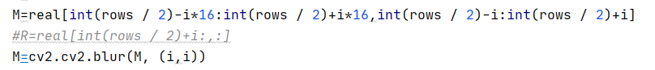{width="5.768055555555556in"
height="0.6208333333333333in"}

由于最后的横向滤波范围截止到rows/32，纵向范围都会从0到1/2。所以横向纵向的每次滤波范围相差16倍。

如图则是滤波效果。可以看到某些区域的融合效果已经还不错了。

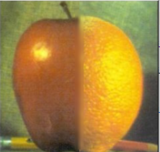

每次滤波次数加一，依次再增加几组滤波，查看效果：

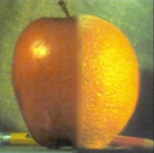{width="1.7833333333333334in"
height="1.774349300087489in"}{width="1.7833333333333334in"
height="1.7833333333333334in"}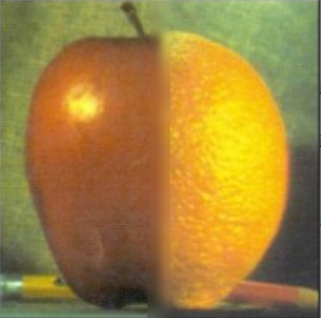{width="1.8083333333333333in"
height="1.7914337270341207in"}

滤波效果尚可，如果再增加一次总体的滤波，可不可以跟利用图像金字塔融合的效果相比呢？增加滤波后如图，分别为均值滤波2\*2，3\*3卷积核滤波效果。仍然可以明显看到一条竖线，这是上文中多次的滤波导致的，下面尝试解决这个问题：

{width="2.1166666666666667in"
height="2.366459973753281in"}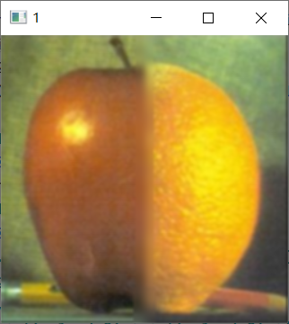{width="2.125in"
height="2.37577646544182in"}

### 3.2.4 过程4

想要过度的更加自然，第一个想到了高斯分布。如果能呈现出高斯分布，过度的自然会更加自然。原来的滤波范围一直是按照规律增加的矩形区域，所以最终的整张图片的滤波后仍然会有明显的分割线。那么不妨在前期的均值滤波中滤波的区域并不直接确定，而是有一个可以波动的范围呢？

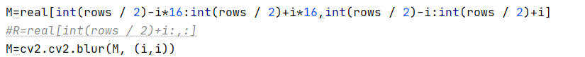{width="5.768055555555556in"
height="0.5659722222222222in"}

{width="2.0166666666666666in"
height="2.0229483814523186in"}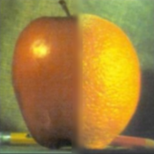{width="2.0083333333333333in"
height="2.0147090988626424in"}

可以看出效果有所提升，但是仍然不够好。

### 3.2.5 过程5

于是我开始想能不能改变我的策略呢？或许均值滤波就是不能更加更加自然，必须要受到旁边的浅色影响才能实现渐变，那就必须要用到了高斯滤波，但是高斯滤波后图片变化太小了！那不妨就试一试更多次的滤波。

那么又该如何解决最后竖线比较突兀的问题呢？还是延续整体进行滤波的方法，但是增加次数！

经过了多次的调参，下面是一个比较好的几个结果。

{width="1.6939206036745407in"
height="1.6833333333333333in"}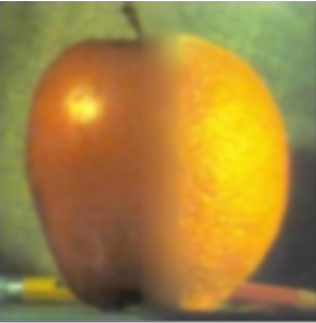{width="1.671311242344707in"
height="1.7083333333333333in"}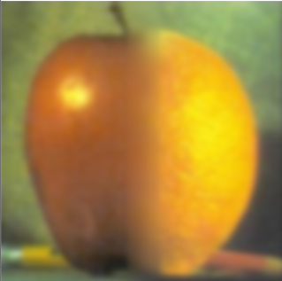{width="1.7107261592300962in"
height="1.7in"}

为了过度自然，只能牺牲细节，不断滤波，这里采用的是均值滤波+高斯滤波不断扩大核大小的方法。

### 3.2.6 方法总结

三、四、五层金字塔方法和本方法对比：

{width="2.6666666666666665in"
height="2.6666666666666665in"}{width="2.6666666666666665in"
height="2.6666666666666665in"}

{width="2.6666666666666665in"
height="2.6666666666666665in"}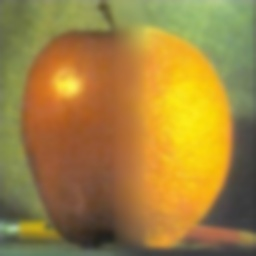{width="2.6666666666666665in"
height="2.6666666666666665in"}

优势：整体的色调变化小

不足：

> 1.但是细节失去了太多了
>
> 2.需要不断地调参
>
> 3.不适合不规则图形地融合

想用更简单的方法来实现基本宣告失败。

3.3 基于SSE的细节恢复实验
-------------------------

### 3.3.1 Retinex图像增强算法SSR

单尺度SSR：

Retinex理论始于Land和McCann于20世纪60年代作出的一系列贡献,其基本思想是人感知到某点的颜色和亮度并不仅仅取决于该点进入人眼的绝对光线，还和其周围的颜色和亮度有关。

Land的Retinex模型是建立在以下的基础之上的：

1.真实世界是无颜色的，我们所感知的颜色是光与物质的相互作用的结果。我们见到的水是无色的，但是水膜---肥皂膜却是显现五彩缤纷，那是薄膜表面光干涉的结果；

2.每一颜色区域由给定波长的红、绿、蓝三原色构成的；

3.三原色决定了每个单位区域的颜色。

Retinex 理论的基本内容：

1.物体的颜色是由物体对长波（红）、中波（绿）和短波（蓝）光线的反射能力决定的，而不是由反射光强度的绝对值决定的；

2.物体的色彩不受光照非均性的影响，具有一致性。

即Retinex理论是以色感一致性（颜色恒常性）为基础的。

观察者所看到的物体的图像S是由物体表面对入射光L反射得到的，反射率R由物体本身决定，不受入射光L变化。

基于Retinex的图像增强的目的就是从原始图像S中估计出光照L，从而降低L的影响，尽量保留物体本质的反射属性，以改善图像的视觉效果,正如人类视觉系统那样。

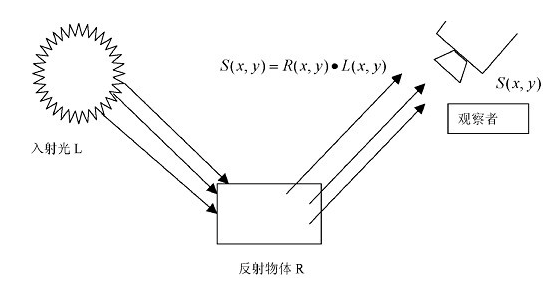{width="2.8in" height="1.4357666229221346in"}

Retinex方法的核心就是估测照度L，从图像S中估测L分量，并去除L分量，得到原始反射分量R。

处理中通常将图片转换到对数域，s=log S ，l=log L ,r=log R
，所以S(x,y)=R(x,y)\*L(x,y)

多尺度MSR(Multi-Scale
Retinex)，是在SSR基础上发展来的，优点是可以同时保持图像高保真度与对图像的动态范围进行压缩的同时，MSR也可实现色彩增强、颜色恒常性、局部动态范围压缩、全局动态范围压缩，也可以用于X光图像增强。最为经典的就是3尺度的，大、中、小，既能实现图像动态范围的压缩，又能保持色感的一致性较好。

求解R是一个奇异问题，只能通过数学方法近似估算。Retinex是一个框架，采用用不同的亮度图像估计算法，其具体形式也不同，但基本流程如下：

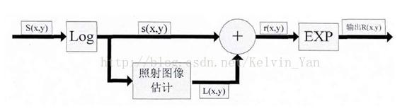{width="4.158333333333333in"
height="1.116431539807524in"}

一般直接通过空间平滑得到照射图像估计，常用的是高斯核的低通滤波。

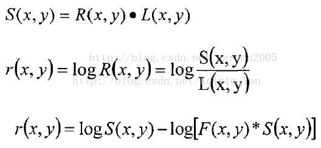{width="2.558333333333333in"
height="1.1822604986876641in"}

以上是单尺度retinex（SSR），多尺度（MSR）的表达式如下：

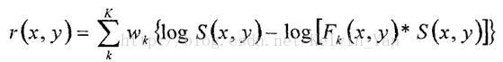{width="3.3666666666666667in"
height="0.4142465004374453in"}

K是尺度数，通常取K为3，并且权值w1=w2=w3=1/3，F是中心环绕函数，即高斯核函数、卷积核：

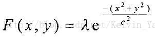{width="1.8583333333333334in"
height="0.47381342957130357in"}

其中λ是归一化常数，确保卷积核内的积分为1；c为卷积核尺寸，retinex中常用的卷积核半径为15,80,120（小、中、大3个尺度）

中心环绕函数可以估计出光照分量L所对应图像的低频成分，并从S中去除低频成分，剩下来的就是高频分量，即反射分量R，保留了图像的边缘细节。

### 3.3.2 SSE实验

在上面学习的时候简单阅读了一些关于基于多尺度变换的图像融合方法的博客介绍，涉及了很多种提取细节再融合的方法。这里采用SSE方法，核心思想是类似于Retinex多尺度的图像细节提升，使用了三个尺度的高斯模糊，再和原图做减法，获得不同程度的细节信息，然后通过一定的组合方式把这些细节信息融合到原图中，从而得到加强原图信息的能力。\[2\]

细节增强前后对比：

{width="2.1666666666666665in"
height="2.1666666666666665in"}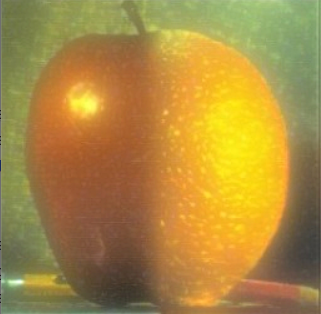{width="2.216666666666667in"
height="2.168327865266842in"}

增加了很多，但是能不能增加更多呢？直接拼接的图象上的细节是最多的，可不可以利用这里的细节来增强呢？

可以，但是连带着分界线也被增强了！

{width="2.325in"
height="2.2742989938757656in"}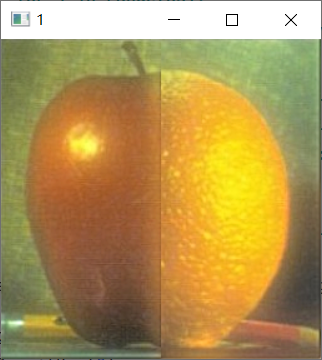{width="2.0833333333333335in"
height="2.329192913385827in"}

这要怎么办呢？我一下就想到了滤波！把这里滤波不就好了吗！让这里没有细节不就好了吗！

下图为金字塔层数为4时进行的实验，依次为4层金字塔，4层金字塔-4层金字塔
增强，4层金字塔-直接拼接滤波 增强。

> {width="1.7201968503937008in"
> height="1.6826826334208225in"}{width="1.662176290463692in"
> height="1.8583333333333334in"}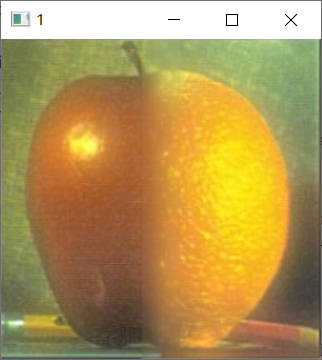{width="1.6540999562554681in"
> height="1.8493055555555555in"}

理想很丰满，现实很骨感，进行滤波之后会延续下来滤波的后变得模糊的这样一个细节，反而是使得融合效果变差了。

金字塔层数为5时进行细节增强：

> {width="1.7083333333333333in"
> height="1.7083333333333333in"}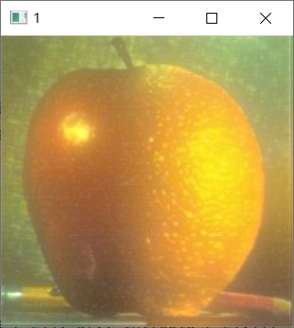{width="1.6919903762029747in"
> height="1.8916666666666666in"}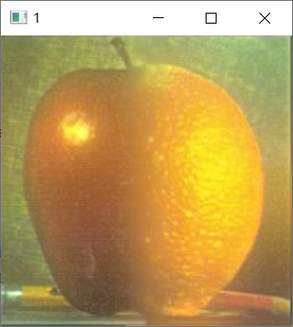{width="1.6666666666666667in"
> height="1.8633530183727034in"}
>
> 金字塔为6层时进行细节增强
>
> {width="1.7166666666666666in"
> height="1.7166666666666666in"}{width="1.6882633420822397in"
> height="1.8875in"}{width="1.7083333333333333in"
> height="1.909938757655293in"}
>
> 可以看到，采用滤波之后的图片和此图片进行细节增强，细节增强效果略好，但是会延续滤波导致的模糊，总体上效果反而没有原来好。所以最后采取的方法还是用本图和本图进行细节增强。
>
> 那么既然效果增强的这么好，为什么不在最后还原的时候每层都加上一个细节增强呢？
>
> 经过我的尝试发现这个思路不可取，因为细节的增强，反而使得分界线处特征再此加强，所以更加明显。
>
> {width="2.183333333333333in"
> height="2.440994094488189in"}

3.4 色彩恢复实验
----------------

### 3.4.1 色彩恢复相关算法

色彩恢复算法有很多种。我想大概分为两大类，基本的色彩恢复算法，和高级的色彩恢复算法。基本的色彩恢复算法就是接对像素级别进行操作的方法。高级的色彩恢复算法则是利用某些框架来实现。

基本的色彩恢复算法，如对数变换，幂律（伽马）变换，分段线性变换等等。对数变换可以拉伸范围较窄的低灰度值，同时压缩范围较宽的高灰度值。可以用来扩展图像中的暗像素值，同时压缩亮像素值。

高级的色彩恢复算法比如彩色恢复多尺度MSRCR算法和色彩增益加权的AutoMSRCR算法。

实验中采用比较基本的算法，gamma变换即gamma矫正。下面一个伽马传说（gamma传说有好多版本，也不知道哪个是正确的）：

在早期，CRT几乎是唯一的显示设备。但CRR有个特性，它的输入电压和显示出来的亮度关系不是线性的，而是一个类似幂律（pow-law）曲线的关系，而这个关系又恰好跟人眼对光的敏感度是相反的。这个巧合意味着，虽然CRT显示关系是非线性的，但对人类来说感知上很可能是一致的。

摄像机的原理可以简化为，把进入到镜头内的光线亮度编码成图像（例如一张JEPG）中的像素。这样很简单啦，如果采集到的亮度是0，像素就是0，亮度是1，像素就是1，亮度是0.5，像素就是0.5。这里，就是这里，出现了一点问题！如果我们假设只用8位空间来存储像素的话，以为着0-1可以表示256种颜色，没错吧？但是，人眼有的特性，就是对光的灵敏度在不同亮度是不一样的。

{width="3.2in"
height="1.7868810148731409in"}

这张图说明一件事情，即亮度上的线性变化在人眼看来是非均匀的，再通俗点，从0亮度变到0.01亮度，人眼是可以察觉到的，但从0.99变到1.0，人眼可能就根本差别不出来，觉得它们是一个颜色。也就是说，人眼对暗部的变化更加敏感，而对亮部变化其实不是很敏感。也就是说，人眼认为的中灰其实不在亮度为0.5的地方，而是在大约亮度为0.18的地方（18度灰）。

那么，这和拍照有什么关系呢？如果在8位图中，我们仍然用0.5亮度编码成0.5的像素，那么暗部和亮部区域我们都使用了128种颜色来表示，但实际上，亮部区域使用这么多种其实相对于暗部来说是种存储浪费。不浪费的做法是，我们应该把人眼认为的中灰亮度放在像素值为0.5的地方，也就是说，0.18亮度应该编码成0.5像素值。这样存储空间就可以充分利用起来了。所以，摄影设备如果使用了8位空间存储照片的话，会用大约为0.45的encoding
gamma来对输入的亮度编码，得到一张图像。0.45这个值完全是由于人眼的特性测量得到的。

那么显示的时候到了。有了一张图片，显示的时候我们还是要把它还原成原来的亮度值进行显示。毕竟，0.45只是为了充分利用存储空间而已。我们假设一下，当年CRT设备的输入电压和产生亮度之间完全是线性关系，我们还是要进行伽马校正的。这是为了把用0.45伽马编码后的图像正确重现在屏幕上。巧合的是，当年人们发现CRT显示器竟然符合幂律曲线！人们想，"天哪，太棒了，我们不需要做任何调整就可以让拍摄的图像在电脑上看起来和原来的一样了"。这就是我们一直说的"那个巧合"。当年，CRT的display
gamma是2.5，这样导致最后的end-to-end gamma大约是0.45 \* 2.5 =
1.125，其实是非1的。

直到后来，微软联合爱普生、惠普提供了sRGB标准，推荐显示器中display
gamma值为2.2。这样，配合0.45的encoding gamma就可以保证end-to-end
gamma为1了。当然，上一节提到的两个观察差异，有些时候我们其实更希望end-to-end
gamma非1的结果，例如，在电影院这种暗沉沉的环境中，end-to-end
gamma为1.5我们人看起来更爽、更舒服，而在明亮的办公室这种环境中1.125的end-to-end
gamma值更舒服、更漂亮。所以，我们可以根据环境的不同，去选择使用什么样的display
gamma。

Gamma 校正是一种非常重要的颜色处理方法。其基本思想是，对 R ， G ，B
每一个色彩空间进行分段，在每一段中利用线性函数来校正。这一系列的线性函数的产生，是基于对
Gamma 曲线的补偿，即利用一系列线性函数来代替 Gamma 曲线关于函数 y=x
的对称曲线。Gamma矫正对图像有显著的影响，不同的Gamma曲线可以取得不同的效果。

### 3.4.2 gamma矫正实验

增强细节后的图片对比原图，色调依旧有所损失。

> {width="2.0in"
> height="2.0in"}{width="1.9916666666666667in"
> height="1.9916666666666667in"}

这里采用了gamma矫正进行实验，左图为增强细节后的图片，右图是将上述图片调节颜色后的图片。

> 四层拉普拉斯金字塔

{width="1.875in"
height="1.875in"}{width="1.8833333333333333in"
height="1.8833333333333333in"}

> 五层拉普拉斯金字塔

{width="1.8916666666666666in"
height="1.8916666666666666in"}{width="1.9166666666666667in"
height="1.9166666666666667in"}

四、总结
========

其实这个实验大概用了几个整天的时间吧，从中秋之前就开始做了，然后放假回来老师也讲了一些，到了28号才基本做完了自己的全部想法。从理论到实践，从基本的金字塔、融合实验到我的新想法、到图片的细节增强、色彩增强我能想到的这些额外的优化方法，总体来说还算满意。

最终图象：

{width="1.9916666666666667in"
height="1.9916666666666667in"}{width="2.0166666666666666in"
height="2.0166666666666666in"}

五、参考文献
============

\[1\]:胡钢, 刘哲,
徐小平等.像素级图像融合技术的研究与进展\[D\].计算机应用研究,
第2５卷第３期2008.3

\[2\]: Youngbae Kim, Yeong Jun Koh等.DARK IMAGE ENHANCEMENT BASED ON
PAIRWISE TARGET CONTRAST AND MULTI-SCALE DETAIL BOOSTING, IEEE
International Conference on Image Processing, ICIP 2015, 1404-1408
